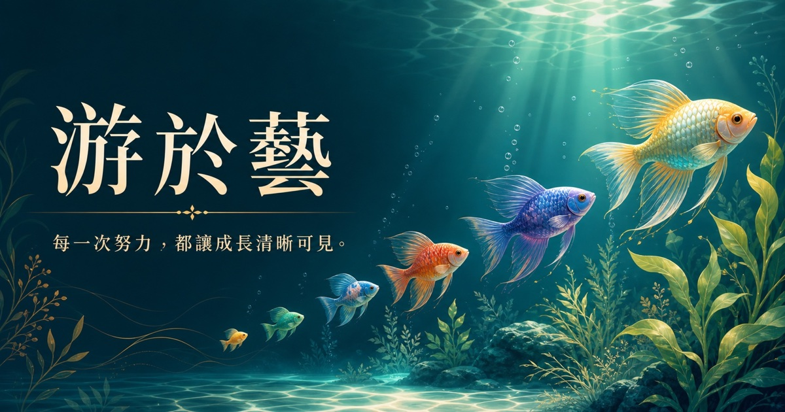

# 游於藝｜學習成就水族館



> 每一次努力，都讓成長清晰可見。
> 每位學生，都是水中獨一無二的風景；餵下一顆星，看見他們自在茁壯。

**線上體驗：[datomusiclab.dpdns.org/linyubert-you-yu-yi-aquarium](https://datomusiclab.dpdns.org/linyubert-you-yu-yi-aquarium/)**

## 這是什麼

「游於藝」是一個把班級經營遊戲化的互動水族箱。老師匯入學生名冊後，每位學生會化身成一尾專屬的魚，優游在班級水族箱裡；每次「餵食」都會讓那尾魚長大一點、累積成長值，讓平常抽象的努力與進步變得看得見、玩得起來。

## 主要功能

- **多班級水族箱**：可自訂多個班級，各自擁有獨立情境（海藻森林、晨光珊瑚礁、月光深海）與班級標語
- **匯入名冊**：支援上傳 CSV / TXT，或直接貼上名單，第一欄自動辨識為學生姓名
- **餵食成長**：點一下魚就能餵食累積成長值，也可以「全班＋1」一次獎勵全班
- **游藝英雄榜**：即時排行榜，依成長值排序，並顯示等級
- **個人化體驗**：可調整魚群游速、開關音效、切換全螢幕觀賞水族箱
- **資料保存在本機**：所有名冊與成長紀錄都存在瀏覽器 `localStorage`，不需要後端資料庫

## 快速開始

```bash
npm install
npm run dev      # 本機開發
npm run build    # 驗證正式建置
```

需要 Node.js `>=22.13.0`。

## 技術架構

專案以 [vinext](https://github.com/cloudflare/vinext)（Next.js on Cloudflare）起手，介面使用 React 19 + Tailwind CSS 4 打造：

- 頁面邏輯在 `app/page.tsx`（純前端元件，無伺服器端資料依賴）
- 版型與 SEO 中繼資料在 `app/layout.tsx`
- 樣式集中於 `app/globals.css`
- `db/`、`drizzle.config.ts`、`examples/d1/` 是可選的 Cloudflare D1 資料庫支援，目前專案未啟用
- `app/chatgpt-auth.ts` 提供選用的 ChatGPT 登入串接，目前首頁未使用

## 靜態站台部署

由於首頁完全是前端互動（狀態存在瀏覽器 `localStorage`），另外提供一份純靜態打包版本，方便部署到 GitHub Pages：

```bash
npx vite build --config vite.config.pages.ts
```

輸出會產生在 `docs/` 資料夾，GitHub Pages 已設定從該資料夾發布。

## 授權

專案內容僅供班級經營與教學使用。
